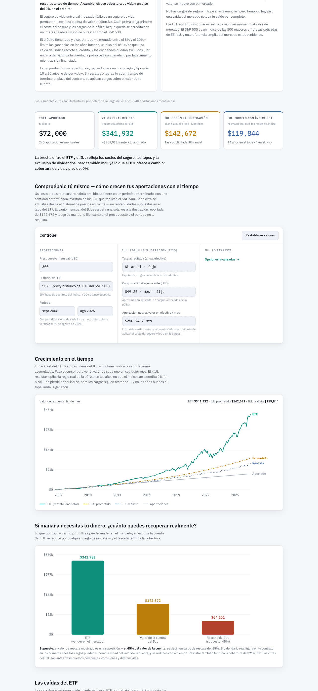

# IUL vs. Direct Investing in an S&P 500 ETF

[](https://github.com/gianni-chepote/iul-vs-direct-investing/actions/workflows/pages.yml)

By **Gianni Chepote** · **Live site:** https://gianni-chepote.github.io/iul-vs-direct-investing/ (in Spanish)

An interactive, data-driven comparison built to answer a real sales pitch: an
Indexed Universal Life (IUL) policy illustrated as turning $300 a month for 20
years ($72,000) into a $142,672 account value and $214,000 of coverage. The page
puts that illustration next to what the same $300 a month would have become in
an S&P 500 ETF, using actual historical prices.



## Result (default window: Sep 2006 – Aug 2026, 240 deposits)

| Series | Value | What it is |
|---|---:|---|
| Total contributed | $72,000 | $300 × 240 months |
| SPY backtest | $341,932 | Actual total return, dividends reinvested |
| IUL, as illustrated | $142,672 | Flat 8% credit, reproduces the illustration |
| IUL, index-linked model | $119,844 | Same policy, credited from the real S&P 500 price index |
| IUL surrender value | $64,202 | Assumed 45% of account value (see limitations) |

The index-linked model hit the 8% cap in 14 of 20 years and the 0% floor in 4.
The ETF's worst peak-to-trough drawdown in the window was −55.2% (March 2009),
which the IUL's floor avoids; the page shows that trade-off rather than hiding it.

## How the model works

- **ETF:** monthly contributions bought at each month-end close, grown with the
  adjusted close (total return). An independent closed-form calculation
  (`Σ budget × P_T / P_k`) cross-checks the iterative balance to the cent.
- **IUL as illustrated (IUL-A):** the illustration gives only a premium, a term
  and an ending value, so a constant monthly charge is solved once so that an
  8% effective annual credit reproduces $142,672 exactly ($49.26 a month). That
  charge is then held fixed and never re-fitted when the user changes inputs.
- **IUL index-linked (IUL-B):** the same premium and the same fitted charge, but
  the balance is credited annually, point-to-point, with the contract rule
  `max(floor, min(cap, participation × index return − spread))` applied to the
  **S&P 500 price index** (`^GSPC`, dividends excluded, as in real IUL contracts).
  Both IUL lines therefore differ only in how cash value is credited.
- Cap, floor, participation and spread are editable; SPY (from 1993) or VOO
  (from Sep 2010, no backfill) can be selected, along with any monthly window.

## Engineering

- `app/calc.js` is the single calculation engine: pure functions with no DOM,
  used unchanged by the browser and by the Node test harness.
- `scripts/verify.mjs` runs 34 checks: illustration checkpoints, the ETF
  cross-check, cap/floor mechanics, zero-return identities, the VOO short window,
  input guards, and data-integrity guards that throw instead of fabricating
  values (for example, VOO before its inception).
- `scripts/build_page.mjs` inlines the engine and the price snapshot into one
  self-contained `app/index.html`: no runtime API calls, no backend.
- CI (`.github/workflows/pages.yml`) runs the harness and confirms the built page
  matches its sources before every GitHub Pages deploy.
- Prices come from Yahoo Finance via `scripts/snapshot_prices.py`, which records
  retrieval time and coverage in `data/provenance.json`. Only completed months
  are used; the current snapshot ends on 31 Aug 2026.

```bash
node scripts/verify.mjs          # 34 checks
node scripts/build_page.mjs      # -> app/index.html

# refresh the price snapshot (optional)
pip install -r scripts/requirements.txt
python scripts/snapshot_prices.py
```

## Limitations

- The policy figures come from one illustration and are not insurer-verified.
- Real IUL charges rise with age; the model uses one constant fitted charge.
- The surrender schedule is contract-specific; the 45% value is an assumption.
- Figures are pre-tax. The IUL's tax-deferred growth and tax-free death benefit
  are real advantages the numbers do not capture.
- A single US index and a single historical path; past returns do not predict
  future ones.

This is an educational comparison, not financial advice.

## Repository layout

```
app/        calc.js (engine), template.html (UI), index.html (built page), og.png
data/       prices.json (cached snapshot), provenance.json
scripts/    verify.mjs, build_page.mjs, snapshot_prices.py
docs/       website-copy.md (all page text), img/ (README images)
```

`app/streamlit_app.py` is an optional wrapper that serves the same page on
Streamlit Cloud; GitHub Pages is the primary host.
